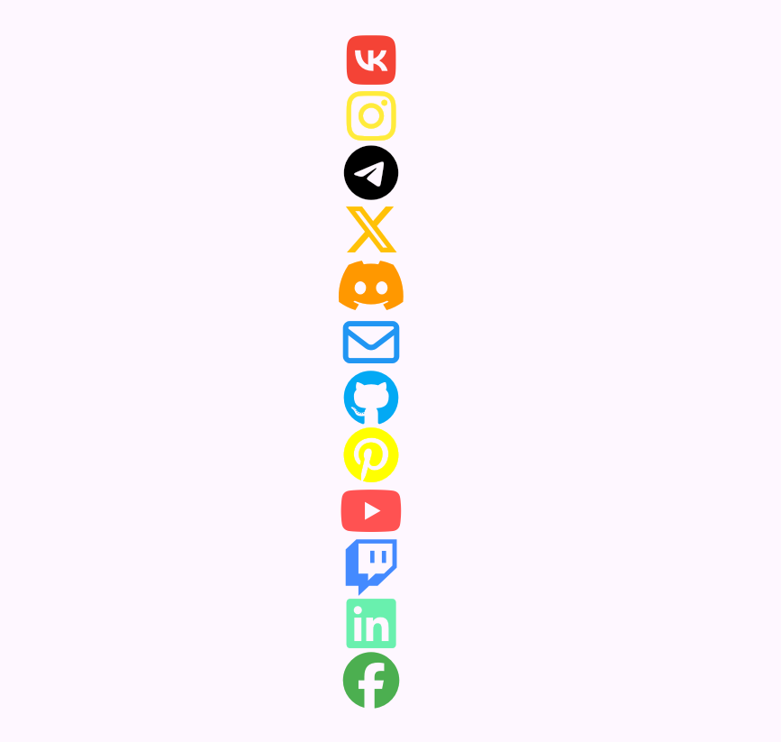

# Contacts Icons

This package provides basic contact widgets in the form of icons. The icons were borrowed from the font_awesome_flutter package. The icons represent social networks.

## Installation

1. Add the latest version of package to your pubspec.yaml:
```dart
dependencies:
  contacts_icons: ^0.0.1
```

2. Import the package and use it in your Flutter App:
```dart
import 'package:contacts_icons/contacts_icons.dart';
```

## Available Icons

Available Icons:
- VK
- YouTube
- Instagram
- Twitter (X)
- Facebook
- TG
- Pinterest
- Discord
- Twitch
- Mail
- LinkedIn
- GitHub

## Features

Features:
- resizing the icon;
- changing the icon color.

## Example

```dart
class HomePage extends StatelessWidget {
  const HomePage({super.key});

  @override
  Widget build(BuildContext context) {
    return Scaffold(
      body: Center(
        child: Column(
          mainAxisAlignment: MainAxisAlignment.center,
          children: [
            VKIcon(size: 50, color: Colors.red),
            InstaIcon(size: 50, color: Colors.yellow),
            TGIcon(size: 50, color: Colors.black),
            XIcon(size: 50, color: Colors.amber),
            DiscIcon(size: 50, color: Colors.orange),
            MailIcon(size: 50, color: Colors.blue),
            GitIcon(size: 50, color: Colors.lightBlue),
            PinIcon(size: 50, color: Colors.yellowAccent),
            YouIcon(size: 50, color: Colors.redAccent),
            TwitIcon(size: 50, color: Colors.blueAccent),
            LIIcon(size: 50, color: Colors.greenAccent),
            FaceIcon(size: 50, color: Colors.green),
          ],
        ),
      ),
    );
  }
}
```
 
